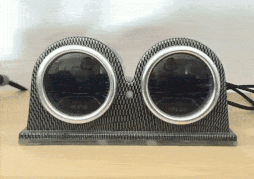
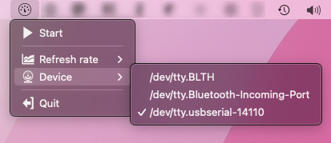

# Automotive gauges for HW monitoring

> **Hello stranger. If you are not sure what it is, you probably don't need this repo.**

 

The software side of the project for converting cheap aliexpress gauges (RPM and Oil pressure in my case) to CPU and Memory indicators.

## Software

This package has only a software part with a simple tray application that allows choosing between ports and refresh rates. Build supports only `darwin+cgo`.

### Build

Just run `make Gauges.app` and check the `out` folder.

## Communication

The [COBS](https://en.wikipedia.org/wiki/Consistent_Overhead_Byte_Stuffing) protocol is used for communication between PC and Arduino via serial port at 115200 baud rate.

There are two types of messages (before COBS encoding) indicated by the first byte:
1. Handshake: `0x01` to start the device.
2. Metric: `0x00 0xMM 0xCC` where:
   * `0xMM` is memory usage in percents rounded to `uint8`
   * `0xCC` is CPU usage in percents rounded to `uint8`

> Not sure if it's a bug in the used Arduino library, or I misinterpreted the COBS protocol, but another `0x00` is required at the end to let the microcontroller properly delimit the messages between itself.

## Hardware

There is no simple approach. Everything should be custom-wired. I utilized 52mm ones from [DynoRacing](https://www.aliexpress.com/item/32671294321.html), connected them to Arduino Nano via PWM output, calibrated, and it was ready to go. Additionally, the photoresistor was added to regulate backlight brightness, especially at night.

The linear calibration `ax+b=y` could work, but I was able to achieve good results with a polynomial curve fitting.
